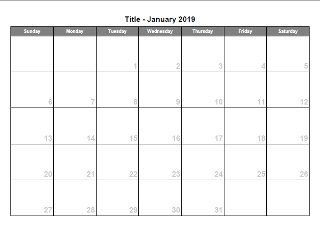
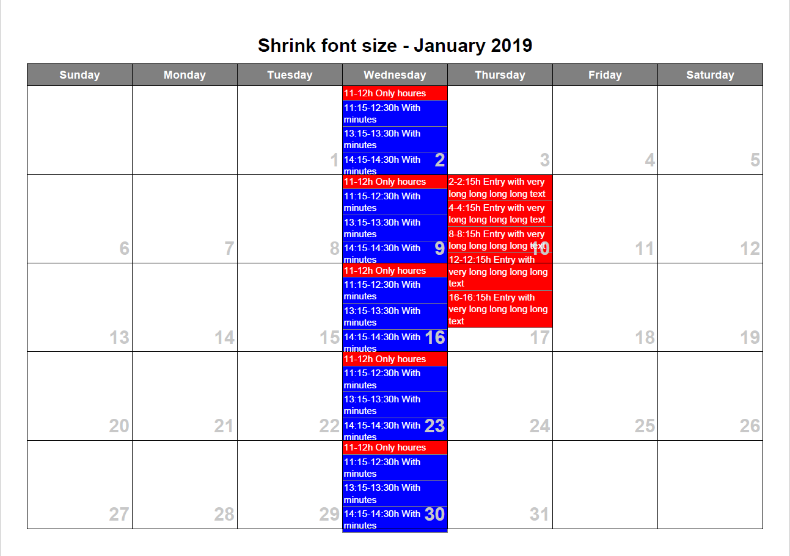
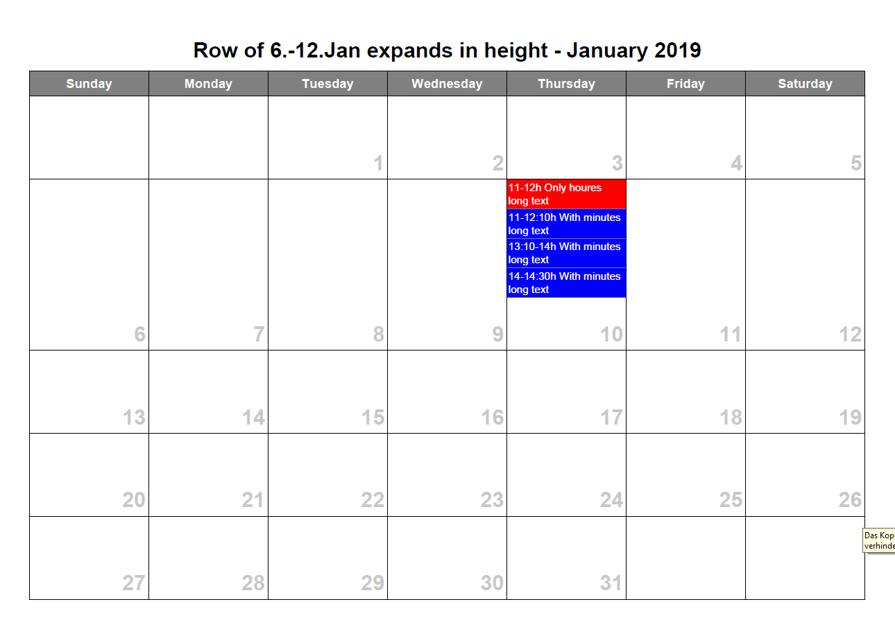
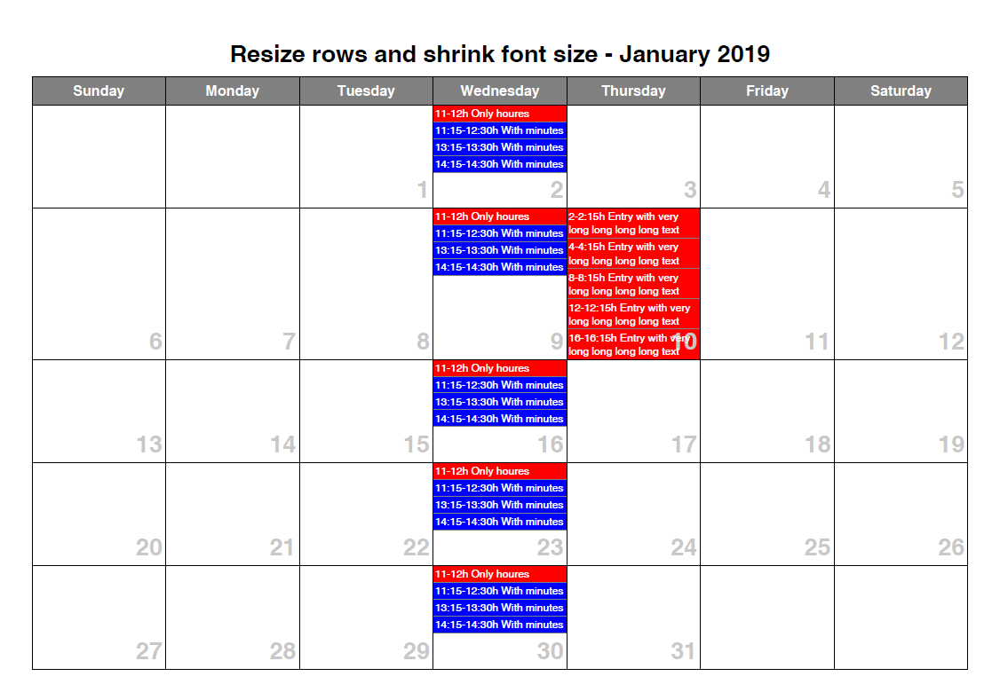
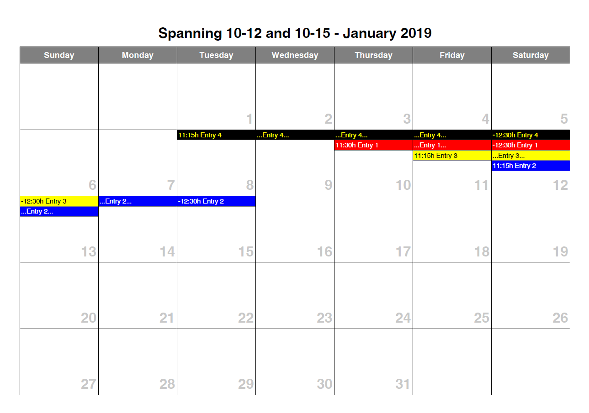

# PDFCalendarBuilder
Generate pdf month calendars with autoscaling/sizing

With the addMonth() introduced in 1.0.8 you can generate a PDF containing
multiple months. Each month will be on it's own page then.

## Unique features
- The class can try to put everything on one page
- In an normal calendar, all rows have the same height
- This library can shrink/expand rows, so everything fits on one page.
See setResizeRowHeightsIfNeeded(true/false);

- If this is not enough, it can reduce the font size until everything fits on one page.
See setShrinkFontSizeIfNeeded(true/false);

## Usage:
In your composer.json add the dependency:

```
    "require": {
        "php": "^7.3",
        "a-schild/pdfcalendarbuilder": ">=1.0.8",
    }
```
### Creating the class and generate calendar
```
$cal = new aschild\PDFCalendarBuilder\CalendarBuilder(1, 2019, "Calendar title", true, 'mm', 'A4');
$cal->startPDF();
$cal->addEntry($startDate, $endDate, "Entry 1", "#000000", "#fffff");
$cal->buildCalendar();
$cal->Output("calendar.pdf", "I");
```

### Creating the class and generate calendar for 3 months (Required version 1.0.7 or higher)
```
$cal = new aschild\PDFCalendarBuilder\CalendarBuilder(1, 2019, "Calendar title Jan", true, 'mm', 'A4');
$cal->startPDF();
$cal->addEntry($startDate1, $endDate1, "Entry 1", "#000000", "#fffff");
$cal->buildCalendar();
$cal->addMonth(2, 2019, "Title for Feb");
$cal->addEntry($startDate2, $endDate2, "Entry 1", "#000000", "#fffff");
$cal->buildCalendar();
$cal->addMonth(3, 2019, "Title for March");
$cal->addEntry($startDate3, $endDate3, "Entry 1", "#000000", "#fffff");
$cal->buildCalendar();
$cal->Output("calendar.pdf", "I");
```

## Examples
- Empty calendar, no entries, just a month grid
  
- Overflowing boxes in normal libraries
  
- Resize row heights to adapt space usage
  
- Resize row heights and shrink font size if needed
  
- Day spanning events
  

(C) 2019 A.Schild

